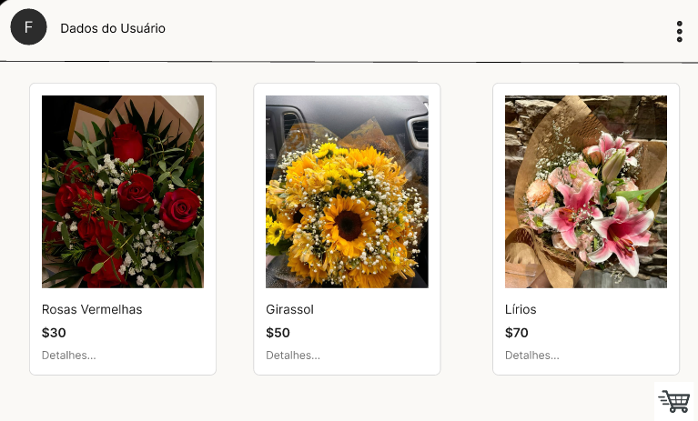
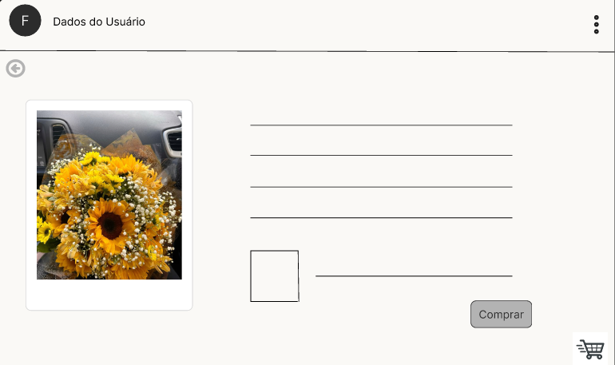
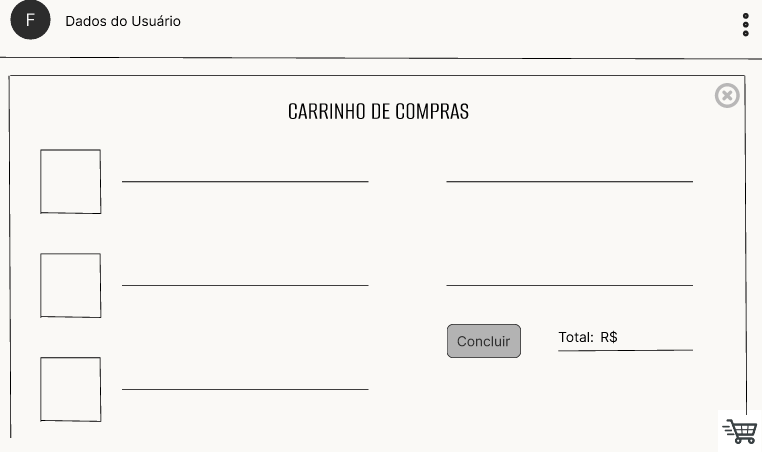
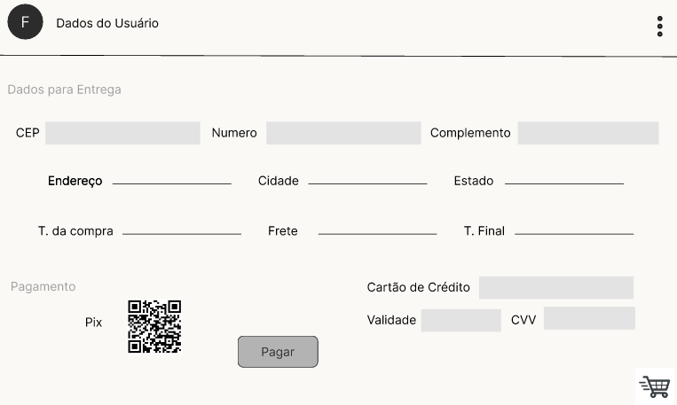
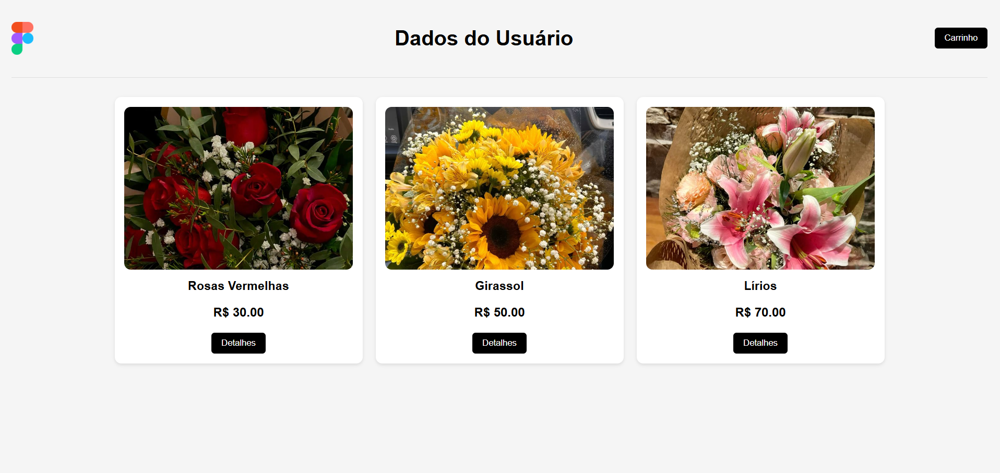
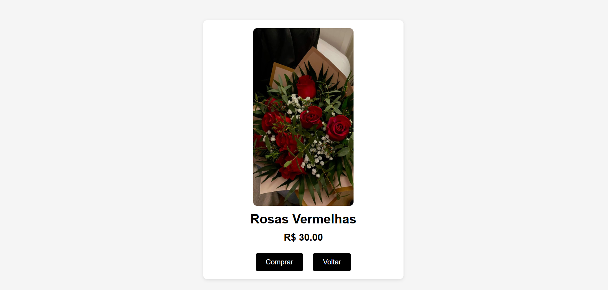
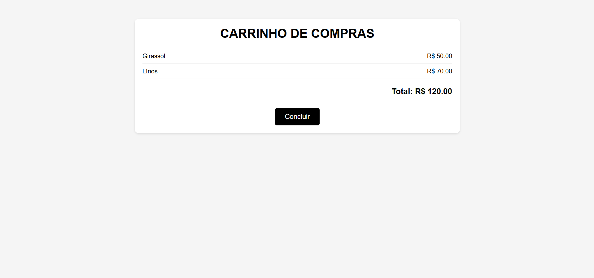
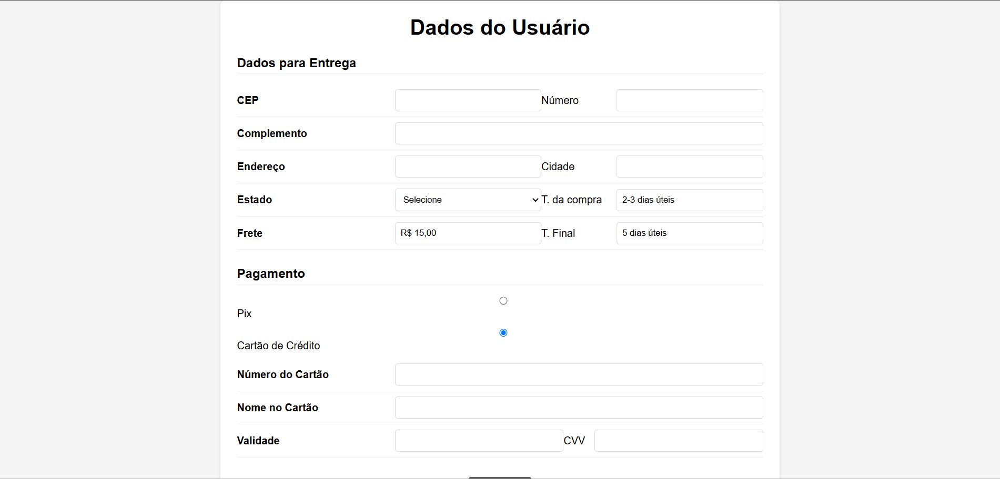

# Lojinha
Carrinho de compras, situação de aprendizagem front-end.

# Link do Figma
[Link do Protótipo](https://www.figma.com/proto/iDObdKW6mWAoQzAy7Ksdwm/Aula-09---Lojinha?node-id=1-4&p=f&t=EGZerdKCEhwpYTKe-1&scaling=scale-down&content-scaling=fixed&page-id=0%3A1&starting-point-node-id=1%3A4)

_Realizado por Beatriz Vizeu_

# Prints do Figma

 
 
 
 

# Prints do Site HTML

 
 
 
 
